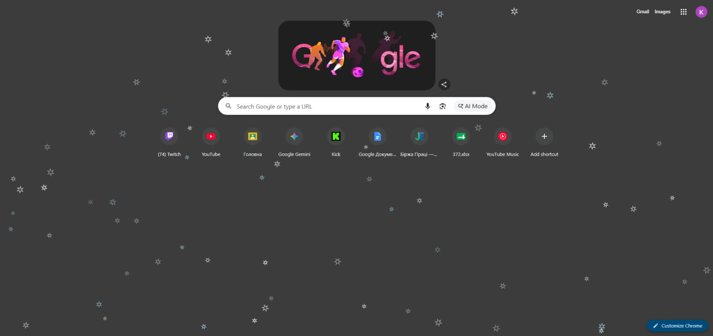

# ❄️ Скрипт «Снігопад»

Проєкт реалізує красиву та плавну анімацію падіння сніжинок. Скрипт розроблено з урахуванням випадкових параметрів для кожної сніжинки (швидкість, розмір, амплітуда коливання), що створює реалістичний ефект зимової атмосфери.

---

## 📝 Опис промту (Prompt)

Для створення та налаштування базової логіки цього скрипту було використано такий текстовий запит:

> *"Напиши JS-скрипт, який малює падаючий сніг  на canvas у браузері.
Вигляд снігу повинен бути не як крапки, а як візерунок (в ідеалі сніжинки). Також 30% повинні бути голубоватих відтінків, але не сильно виділялися.
Код має бути готовий для запуску просто в консолі."*

---

## 🛠️ Використаний ai-асистент: Gemini 3.5 Flash
* **Динамічна генерація:** Сніжинки створюються автоматично з випадковим радіусом та прозорістю.
* **Фізика руху:** Падіння вниз по осі `Y` поєднується з синусоїдальним коливанням по осі `X` для імітації легкого вітру.
* **Оптимізація:** Скрипт автоматично підлаштовується під розміри вікна/екрана та працює стабільно без навантаження на систему.

---

## 🖼️ Візуальна демонстрація та скриншоти

Нижче представлено інтерфейс програми та структуру розміщення елементів.

### Скріншот промту

### Результат виконання скрипту
> *Опис:* Демонстрація стабільної роботи скрипту та фінальний результат візуального ефекту.

---

## 🚀 Як запустити проєкт
1. Скопіюйте код з файлу script.js.
2. Відкрийте консоль в браузері (F12).
3. Спробуйте вставити, якщо не виходить введіть команду *allow pasting*.
