# Лабораторна №22 — Горизонтальне масштабування

**ПІБ:** Зирянов Кирило Олегович
**Група:** 372
**Дата:** 15.06.2026

---

## Завдання 1 — Baseline (1 репліка)

Для виконання цього завдання було ініційовано початкову збірку проєкту за допомогою команди `docker compose build`. Після успішного завершення білду сервіс було розгорнуто в єдиному екземплярі у фоновому режимі командою `docker compose up -d`. Стан запущених процесів було перевірено через `docker compose ps`, а роботу самого додатка — шляхом відкриття сторінки в браузері та її багаторазового оновлення.

**Скрін 1.1** — сторінка http://localhost:8080 з одним hostname:

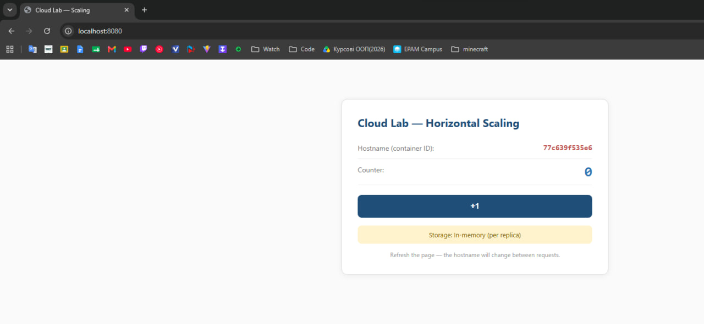

**Скрін 1.2** — `docker compose ps`:

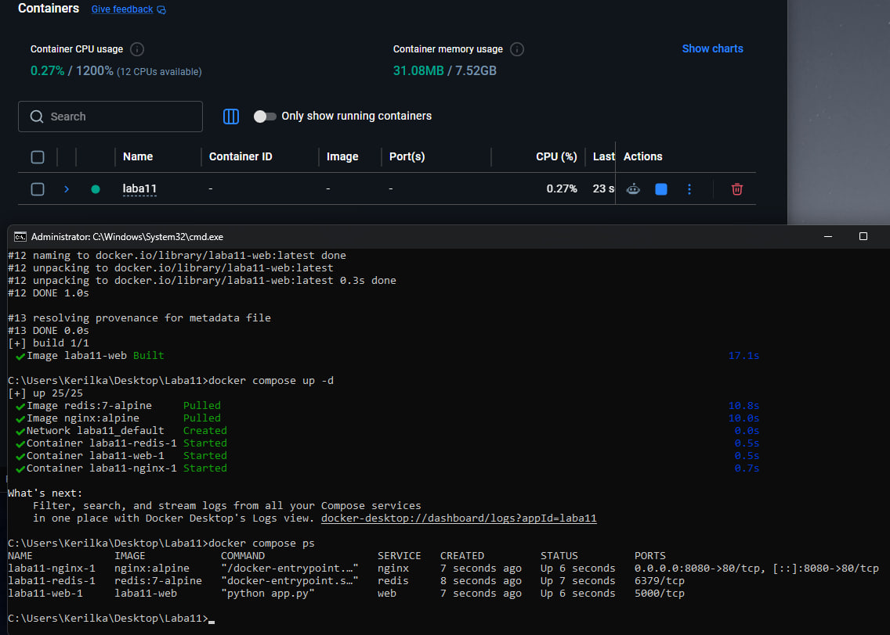

**Що показує поле Hostname і чому воно не змінюється:**

Поле *Hostname* відображає унікальний ідентифікатор (ID) конкретного Docker-контейнера, який обробив поточний HTTP-запит користувача. Воно не змінюється при оновленні сторінки, оскільки в системі запущено лише одну репліку вебдодатка, і балансувальник Nginx направляє весь вхідний трафік виключно на цей єдиний доступний контейнер.

---

## Завдання 2 — Scale out (3 репліки)

Поточний baseline-запуск було зупинено командою `docker compose down`. Після цього систему було масштабовано горизонтально, запустивши три паралельні репліки вебсервера за допомогою команди `docker compose up -d --scale web=3`. Успішний запуск трьох ізольованих контейнерів підтверджено утилітою моніторингу процесів.

**Скрін 2.1** — `docker compose ps` з трьома репліками:

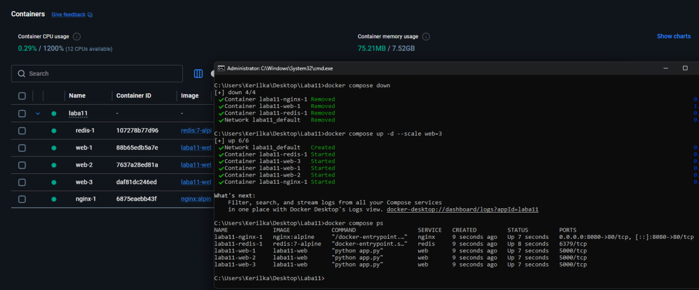

**Скрін 2.2** — три послідовні оновлення сторінки з різними hostname:

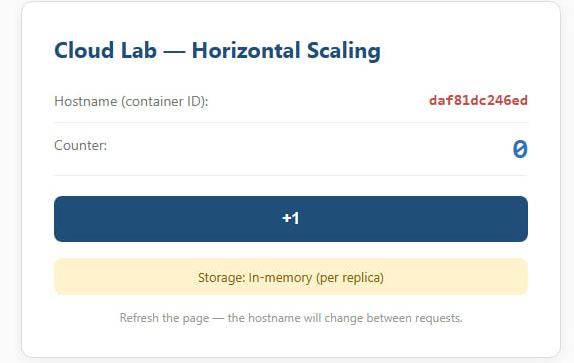
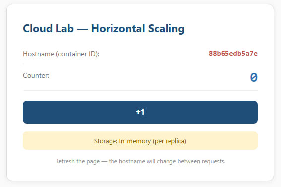
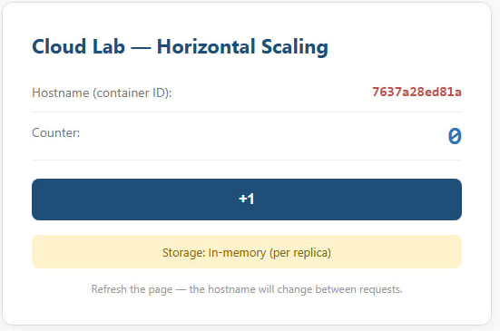

**Який тип балансування використовує nginx і чому користувач бачить різний hostname:**

Nginx використовує класичний алгоритм балансування **Round-Robin** (круговий обхід), який циклічно та рівномірно розподіляє нові HTTP-запити між наявними серверами. Користувач бачить інший *Hostname* при кожному оновленні, оскільки Nginx по черзі перенаправляє його запити на кожен із трьох запущених контейнерів (`web-1`, `web-2`, `web-3`).

---

## Завдання 3 — Stateless-пастка

На сторінці додатка з трьома активними репліками було здійснено швидке серійне натискання кнопки «+1» (понад 10 разів поспіль) для перевірки коректності збереження стану системи за умов динамічного балансування трафіку.

**Скрін 3.1** — приклад «стрибаючого» лічильника (мінімум 4-5 послідовних натискань з аномальними значеннями):

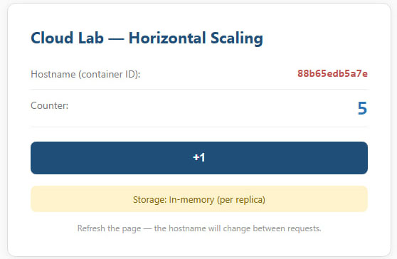
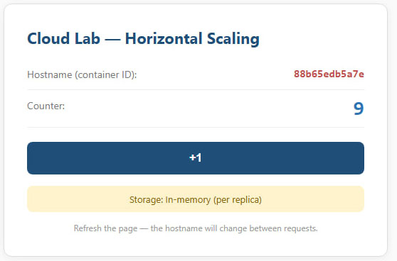

**Чому так відбувається (3-5 речень своїми словами):**

Ця аномалія виникає через те, що додаток є *stateful* і зберігає значення лічильника безпосередньо всередині оперативної пам'яті (In-Memory) самого Flask-процесу. Оскільки ми масштабували сервіс до трьох реплік, у кластері утворилося три абсолютно ізольованих місця в пам'яті з власними незалежними лічильниками. Балансувальник Nginx розподіляє кліки користувача між цими трьома контейнерами по черзі, тому при оновленні сторінки ми бачимо стан то однієї, то іншої репліки, що створює ефект хаотичних "стрибків" чисел.

---

## Завдання 4 — Виправлення через Redis

Для усунення проблеми ізольованих станів систему було зупинено. Повторний запуск трьох веб-реплік виконано з активацією конфігураційного прапорця для переходу на зовнішню базу даних за допомогою команд `set USE_REDIS=true` та `docker compose up -d --scale web=3`.

**Скрін 4.1** — сторінка з монотонним лічильником після `USE_REDIS=true`:

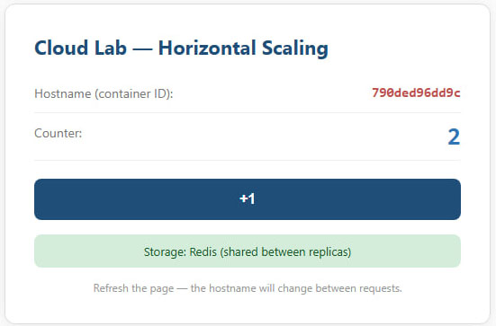

**Скрін 4.2** — `docker compose ps` із redis-контейнером:

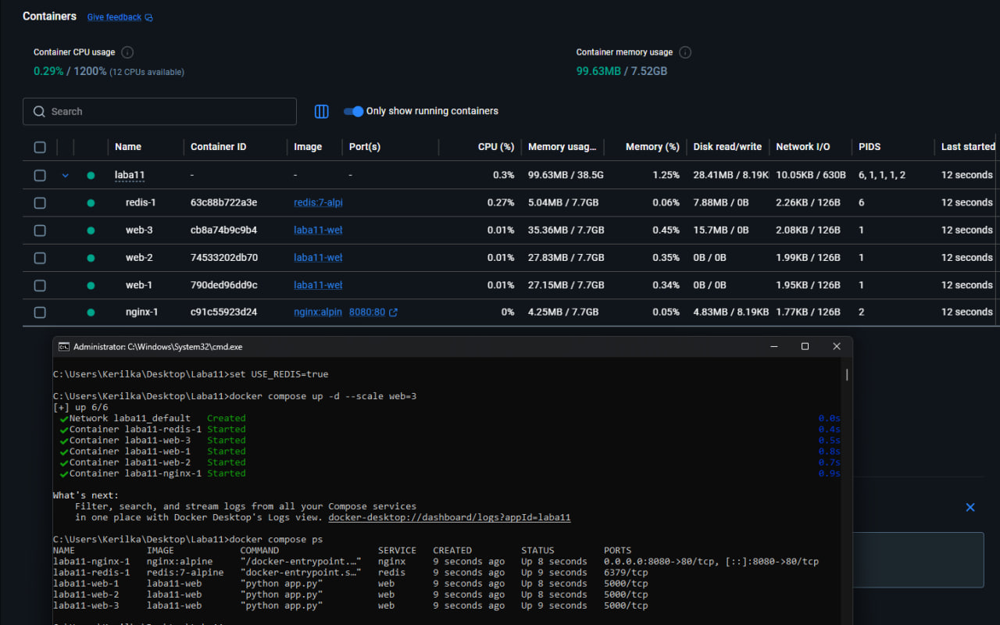

**Роль Redis у системі (2-3 речення):**

У цій архітектурі Redis виконує роль спільного зовнішнього сховища стану (External State Store) для всього кластера. Веб-репліки стають повністю *stateless*: вони більше не тримають лічильник у своїй пам'яті, а при кожному кліку звертаються до однієї спільної "точки правди" в Redis. Як результат, дані коректно синхронізуються, і лічильник зростає строго монотонно, навіть коли запити продовжують балансуватися між різними хостами.

---

## Завдання 5 — Resilience

Для перевірки стійкості кластера до критичних збоїв було виконано команду `docker compose ps` для пошуку ідентифікаторів процесів. Після цього одну з робочих веб-реплік було примусово завершено за допомогою команди `docker kill <container_id>`, імітуючи раптове падіння хмарного сервера.

**Скрін 5.1** — `docker compose ps` після `docker kill` (одна репліка Exited/Down, інші Up):

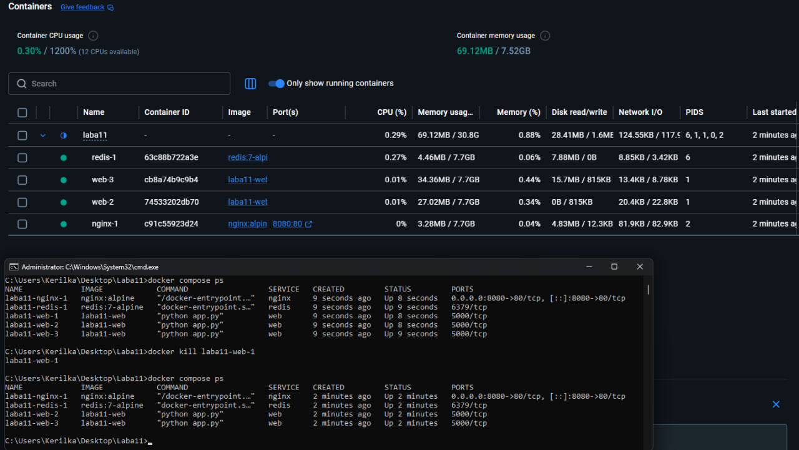

**Скрін 5.2** — сторінка все ще працює після вбивства репліки:

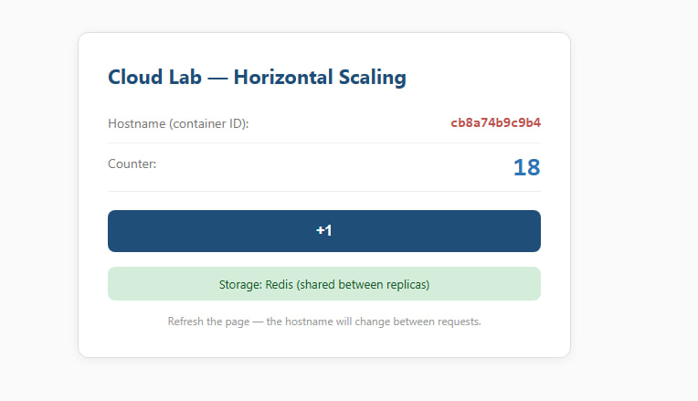

**Чому користувач не помітив відмови (2-3 речення):**

Кінцевий користувач не помітив збою завдяки забезпеченню надлишковості (*redundancy*): дві інші репліки залишилися активними та перебрали на себе все навантаження. Балансувальник Nginx автоматично виявив падіння вузла, миттєво виключив його з ротації та перенаправив трафік на живі сервери без генерації помилок для клієнта. Оскільки стан лічильника був надійно збережений у Redis, користувач зміг продовжити роботу з актуальними даними.

---

## Відповіді на питання

### 1. Чому horizontal масштабування зазвичай дешевше і гнучкіше за вертикальне?

Горизонтальне масштабування дозволяє нарощувати загальну потужність системи шляхом поступового додавання звичайних, бюджетних серверів, а також гнучко відключати їх під час спаду трафіку для оптимізації витрат.

### 2. Що станеться з монолітом із in-memory сесіями, якщо запустити його у 3 екземплярах за балансувальником?

Користувач зіткнеться з нестабільною роботою вебдодатка через постійну втрату стану авторизації та сесійних даних. Після успішного логіну на першому екземплярі, наступний клік користувача може бути перенаправлений балансувальником на другий екземпляр, який нічого не знає про цю сесію, через що сайт знову викине користувача на сторінку авторизації.

### 3. Які керовані сервіси AWS / Azure / GCP виконують роль зовнішнього сховища стану (як Redis у цій лабі)?

* **AWS:** *Amazon ElastiCache for Redis* (або *Amazon MemoryDB for Redis*).
* **Azure:** *Azure Cache for Redis*.
* **GCP (Google Cloud):** *Google Cloud Memorystore for Redis*.

### 4. SLA: якщо кожна репліка має SLA 99%, скільки приблизно становить сумарний SLA кластера з 3 паралельних реплік? Чому redundancy «множить дев'ятки»?

Для трьох паралельних незалежних реплік сумарний SLA кластера становитиме **99.9999%** (31 секунда простою на рік). Ймовірність відмови одного вузла дорівнює $1\% = 0.01$. Кластер повністю вийде з ладу лише за умови, що всі три незалежні репліки впадуть одночасно. Надлишковість «множить дев'ятки» саме тому, що загальна ймовірність відмови системи зменшується геометрично з додаванням кожного нового дублюючого компонента.

### 5. Назви хоча б один тип додатку, який не можна просто масштабувати горизонтально через `--scale=N`. Чому?

Реляційні бази даних, такі як **PostgreSQL** або **MySQL**. Якщо запустити їх простим копіюванням через параметр масштабування з окремими ізольованими дисками, вони миттєво втратять цілісність та актуальність даних, оскільки різні екземпляри не зможуть синхронізувати між собою операції паралельного запису, транзакції та блокування таблиць. Масштабування таких систем вимагає впровадження набагато складніших архітектурних паттернів.

---

## Чек-лист перед здачею

- [x] Заповнена титулка (ПІБ, група, дата).
- [x] Усі 5 обов'язкових завдань мають скріни і відповіді.
- [x] На скрінах видно URL/команди й результати.
- [x] Картинки в папці `images/` поруч із цим файлом.
- [x] Відповіді на 5 питань написані своїми словами.
- [x] Файл перейменовано на `lab_scaling_Зирянов.md`.
