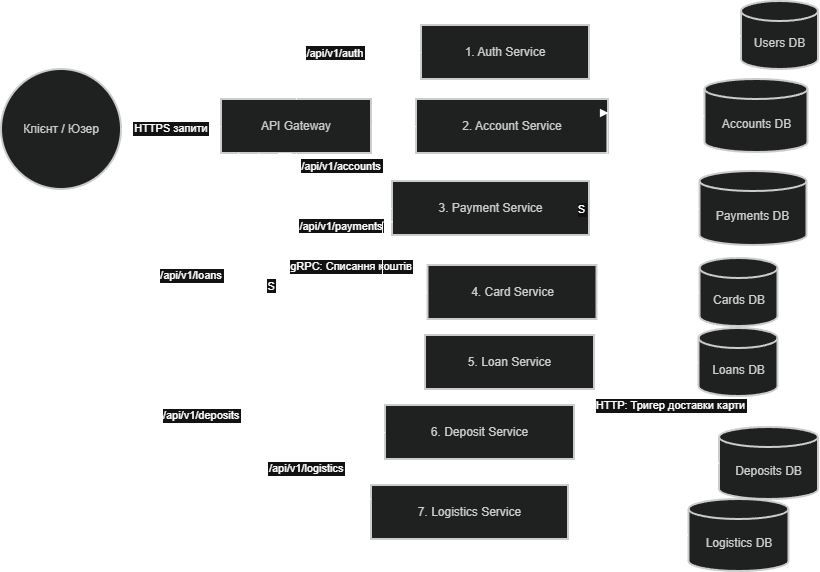

# 🏦 Проєкт: Архітектура Банківської Системи

Цей документ містить детальний опис архітектури, розподілу доменних областей, обґрунтування вибору технологічного стеку та сценаріїв взаємодії ключових сервісів банківської платформи.

---

## 🎯 1. Виділення доменних областей

Для забезпечення гнучкості, масштабованості та ізоляції бізнес-логіки, систему було розділено на такі ключові домени:

* **🔑 Управління користувачами та доступом** — відповідає за автентифікацію, авторизацію, профілі користувачів та розмежування прав доступу (RBAC/ABAC).
* **💰 Рахунки та Баланси** — серце банку. Цей домен забезпечує збереження інформації про грошові кошти, поточні баланси та ведення облікових книг (Ledger).
* **💸 Платежі та Перекази** — сервіс, який повністю керує рухом грошей (транзакції, оплата послуг, внутрішні та зовнішні перекази).
* **💳 Картковий процесинг** — логіка, що пов'язана з емісією, обслуговуванням та блокуванням фізичного і віртуального пластику.
* **📉 Кредитування та Фінансування** — домен, що відповідає за розрахунок лімітів, видачу позикових коштів та автоматичну оцінку ризиків (скоринг).
* **📊 Депозити та Інвестиції** — залучення капіталу, нарахування відсотків та управління довгостроковими активами.
* **📦 Підтримка, Логістика та Доставка** — операційні процеси взаємодії з фізичним світом (доставка карток клієнтам, логістика документів тощо).

---

## 📊 2. Архітектурна діаграма

---

## 🏗️ 3. Вибір типу архітектури: Мікросервіси

Для реалізації платформи було обрано **мікросервісну архітектуру**. Нижче наведено ключові фактори, що зумовили це рішення:

1.  **Розмір і складність проєкту**
    Банк об'єднує занадто різні за своєю природою бізнес-процеси — від видачі кредитів до фізичної логістики. Мікросервіси дозволяють розділити цей колосальний обсяг на **7 простих, незалежних та ізольованих програм**.
2.  **Користувачі та масштабування**
    Навантаження від мільйонів клієнтів є нерівномірним у часі. Архітектура дозволяє точково масштабувати лише, наприклад, `payment-service` під час пікових навантажень (Чорна п'ятниця, новорічні розпродажі), суттєво заощаджуючи хмарні ресурси.
3.  **Частота змін**
    Фінансові фічі, вимоги регуляторів та закони змінюються постійно. Розробники можуть оновлювати та деплоїти `loan-service` незалежно, абсолютно не ризикуючи зламати авторизацію чи проведення платежів.
4.  **Логіка та автономність команд**
    Структура ідеально ділить відповідальність: одна cross-functional команда повністю володіє одним сервісом та його виділеною базою даних. Це усуває конфлікти під час злиття коду (merge conflicts) та значно пришвидшує релізи (Time-to-Market).
5.  **Висока відмовостійкість (Fault Tolerance)**
    У класичному моноліті одна критична помилка або витік пам'яті може повністю зупинити весь банк. У мікросервісній моделі, якщо навіть тимчасово впаде сервіс логістики, люди все одно зможуть безперешкодно платити картками в магазинах.

---

## 🔄 4. Опис взаємодії між мікросервісами

Маршрутизація та комунікація між сервісами реалізована через синхронні та асинхронні запити. Нижче наведено життєвий цикл двох базових бізнес-сценаріїв.

### 💳 Сценарій 1: Проведення P2P-переказу (між картками)
*Найбільш високонавантажений процес системи, який задіює API Gateway, сервіс платежів та ядро рахунків.*

Клієнт --> api-gateway     : POST /api/v1/payments/p2p (Ініціювати переказ)

api-gateway --> auth-service    : Перевірка токена безпеки (JWT) та прав клієнта

payment-service --> account-service : GET /api/v1/accounts/{id}/balance (Чи достатньо коштів?)

payment-service --> card-service    : POST /api/v1/cards/validate (Чи не заблокована картка отримувача?)

payment-service --> account-service : POST /api/v1/accounts/transfer (Запит на транзакцію)

account-service --> payment-service : Статус 200 OK (Баланси відправника та отримувача успішно оновлено)

---

### 📉 Сценарій 2: Оформлення короткострокової позики
*Процес, що вимагає миттєвої автоматичної перевірки фінансової надійності клієнта (скорингу).*

Клієнт --> api-gateway     : POST /api/v1/loans/apply (Заявка на кредит)

loan-service --> account-service : GET /api/v1/accounts/history (Аналіз оборотів по рахунках за 6 місяців)

loan-service --> Внутрішній блок : [Скоринг]: Розрахунок ризиків та ухвалення рішення за алгоритмом

loan-service --> account-service : POST /api/v1/accounts/deposit-loan (Зарахування суми на поточний рахунок)

*Примітка: Зарахування запозиченої суми (the principal) відбувається автоматично після успішного проходження скорингової моделі.*
