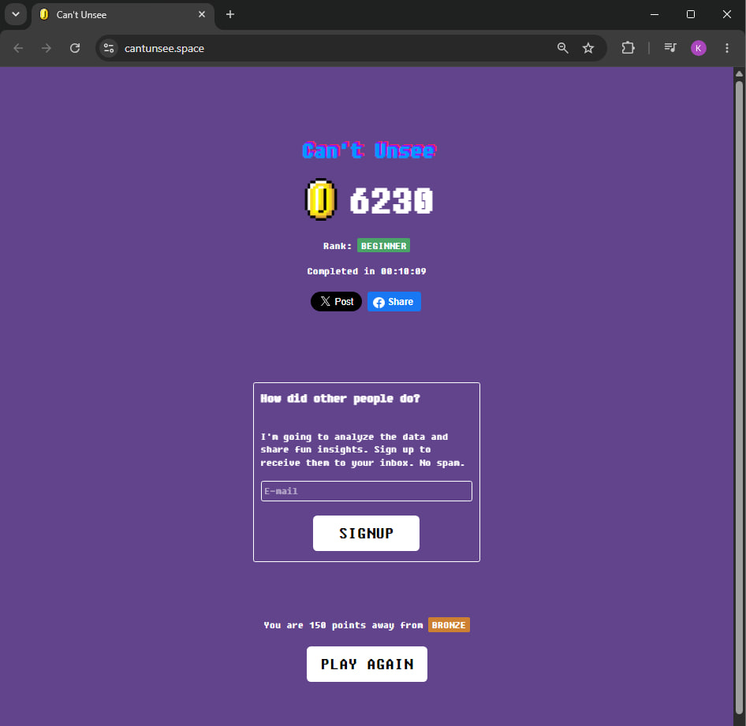

# 🔐 Процес розробки та тестування форми авторизації (Login Form)

---

## 👥 1.1 Ролі, задіяні у роботі над фічею, та їхні обов'язки

* **Product Manager (PM)**
    * *Обов'язки:* Описує бізнес-вимоги та критерії прийняття (Acceptance Criteria). Наприклад: *"Користувач повинен залогінитися за 3 секунди"*, *"Після 5 невдалих спроб аккаунт блокується"*. Створює та пріоритезує таску в Беклозі (Jira/Trello).
* **UI/UX Designer**
    * *Обов'язки:* Створює візуальний макет форми логіну (у Figma) для десктопної та мобільної версій. Продумує UX (досвід користувача): де саме відображати помилку, як підсвічувати активні поля, де розмістити кнопку відновлення пароля.
* **Frontend Developer**
    * *Обов'язки:* Верстає інтерфейс за макетами Figma (HTML/CSS або за допомогою React/Angular/Vue). Реалізує клієнтську валідацію полів (наприклад, перевірка наявності символу `@` в Email ще до відправки запиту).
* **Backend Developer**
    * *Обов'язки:* Створює API-ендпоінт (наприклад, `/api/auth/login`), який приймає Email та Password, хешує пароль, звіряє його з базою даних, генерує безпечний сесійний токен (JWT) та повертає статус відповіді (200 OK або 401 Unauthorized).
* **QA Engineer (Manual / Automation)**
    * *Обов'язки:* Аналізує вимоги, створює тест-кейси та чек-листи. Тестує форму на різних етапах розробки, перевіряє позитивні та негативні сценарії, заводить баг-репорти та проводить ретест після виправлення помилок девелоперами.
* **DevOps Engineer**
    * *Обов'язки:* Налаштовує CI/CD процеси, щоб код розробників автоматично збирався, проходив тести та деплоївся на тестові та продуктивні сервери.

---

## 📐 1.2 Рівні тестування (Levels of Testing)

1.  **Unit Testing (Модульне тестування)**
    * *Хто робить:* Розробники.
    * *Що перевіряють:* Окремі маленькі функції.
2.  **Integration Testing (Інтеграційне тестування)**
    * *Хто робить:* Розробники та QA.
    * *Що перевіряють:* Взаємодію між компонентами. Наприклад, чи правильно Frontend передає дані з полів введення в API-запит до Backend, і чи правильно Backend звертається до Бази Даних для пошуку користувача.
3.  **System Testing (Системне тестування)**
    * *Хто робить:* QA Engineers.
    * *Що перевіряють:* Тестування всієї системи в зборі як єдиного цілого. Симуляція реального користувача: відкрити браузер, ввести дані, натиснути "Login", перевірити перенаправлення або появу повідомлення про помилку.
4.  **Acceptance Testing (Приймальне тестування)**
    * *Хто робить:* QA, або кінцеві замовники (UAT).
    * *Що перевіряють:* Чи відповідає готова фіча початковим бізнес-вимогам, описаним Product Manager-ом. Це фінальний етап перед випуском фічі.

---

## 🧪 1.3 Типи тестування для форми логіну

### 🔹 Функціональні типи тестування (Functional)

* **Positive Testing:** Введення валідного Email та пароля --> успішний вхід.
* **Negative Testing:**
    * Введення неіснуючого Email.
    * Введення невірного пароля для існуючого Email.
    * Спроба надіслати порожню форму.
    * Перевірка відображення тексту помилки при невірному вводі.
* **Аналіз граничних значень:** Перевірка обмежень на довжину полів (наприклад, якщо пароль має бути від 8 до 32 символів, перевіряємо 7, 8, 32 та 33 символи).
* **UI Testing (Тестування інтерфейсу):** Перевірка відповідності макету з Figma. Чи правильний колір у кнопки "Login", чи видно її текст, чи стає поле червоним при помилці.
* **Forgot Password Flow:** Перевірка натискання на лінк "Forgot password?" — чи перенаправляє він на форму відновлення доступу.

### 🔹 Нефункциональні типи тестування (Non-Functional)

* **Security Testing (Тестування безпеки) — *Критично для логіну!*:**
    * Перевірка, чи маскуються символи пароля крапками (`***`) при введенні.
    * Перевірка, чи передаються дані через захищений протокол `HTTPS` (а не `HTTP`).
    * Перевірка стійкості до атак типу SQL Injection або XSS через поля введення.
    * Перевірка захисту від Brute Force (підбору паролів за допомогою роботів) — чи з'являється капча або блокування після серії невдалих спроб.
* **Performance Testing (Тестування навантаження):** Перевірка того, як форма поводиться, якщо одночасно користуються 10,000 користувачів.
* **Cross-Platform Testing:** Перевірка роботи та відображення форми в різних браузерах (Chrome, Safari, Firefox, Edge) та на різних пристроях (PC, MacOS, iPhone, Android).
* **Usability Testing (Тестування зручності використання):** Оцінка зручності. Чи достатньо великі кнопки для натискання пальцем на мобільному, чи зрозумілий текст помилки користувачеві.
* **Accessibility Testing (Доступність):** Перевірка, чи можуть люди з інвалідністю скористатися формою.

---

# 🎮 Завдання 2. Знайди різницю в макетах

##Скріншот проходження гри

