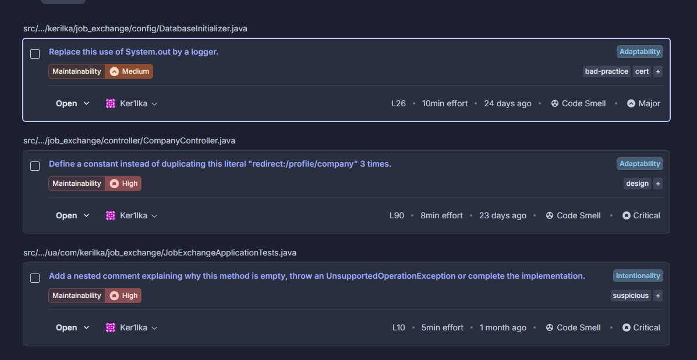
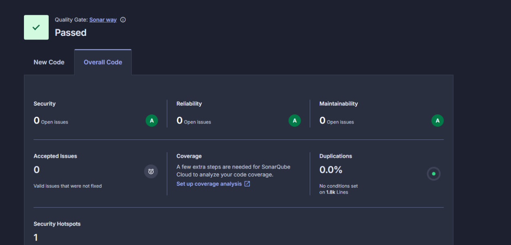

# Лабораторна робота №8: Статичний аналіз якості коду за допомогою SonarQube Cloud

Ця лабораторна робота присвячена інтеграції інструменту стачного аналізу коду **SonarQube Cloud** у проект на Spring Boot для виявлення "запахів коду" (Code Smells), потенційних багів та вразливостей, а також для підвищення підтримуваності (Maintainability) додатку.

---

## 🔗 Важливі посилання

* **Репозиторій проєкту:** [Посилання на твій GitHub](https://github.com/Ker1lka/Job_Exchange)
* **Дашборд проєкту в SonarQube Cloud:** [Переглянути аналіз проєкту](https://sonarcloud.io/summary/overall?id=Ker1lka_Job_Exchange&branch=main)

---

## 🔍 Звіт про початковий аналіз коду

Під час першого сканування SonarQube Cloud виявив **3 зауваження (Code Smells)** типу *Maintainability* (два з високим пріоритетом *High* та одне з середнім *Medium*).

### Виявлені дефекти та їх виправлення:

1.  **Заміна виклику системного виводу на логер**
    * *Файл:* `DatabaseInitializer.java` (L26)
    * *Проблема:* Використання `System.out` є поганою практикою для серверних додатків, оскільки воно забиває консоль і не дозволяє гнучко керувати рівнями логування.
    * *Рішення:* Виклик замінено на стандартне логування `log.info()` за допомогою бібліотеки SLF4J / Lombok.

2.  **Дублювання рядкових літералів**
    * *Файл:* `CompanyController.java` (L90)
    * *Проблема:* Текст `"redirect:/profile/company"` дублювався в коді контролера 3 рази, що порушує принцип розробки DRY (Don't Repeat Yourself).
    * *Рішення:* Рядок винесено в окрему приватну константу класу `private static final String REDIRECT_PROFILE_COMPANY`, яка тепер перевикористовується в методах.

3.  **Порожній тестовий метод без коментаря**
    * *Файл:* `JobExchangeApplicationTests.java` (L10)
    * *Проблема:* Порожній метод `contextLoads()` викликав підозру аналізатора, оскільки відсутність коду або пояснення може свідчити про незавершену реалізацію.
    * *Рішення:* Всередину методу додано документуючий коментар, який пояснює, що метод слугує виключно для перевірки базової ініціалізації Spring-контексту.

---

## 📊 Висновок
Завдяки інтеграції SonarQube Cloud вдалося знайти слабкі місця в стилі написання коду Java. Всі виявлені зауваження були успішно виправлені у середовищі розробки IntelliJ IDEA та завантажені в репозиторій, що дозволило досягти вищого показника чистоти коду (Clean Code) та успішного проходження критеріїв Quality Gate.
